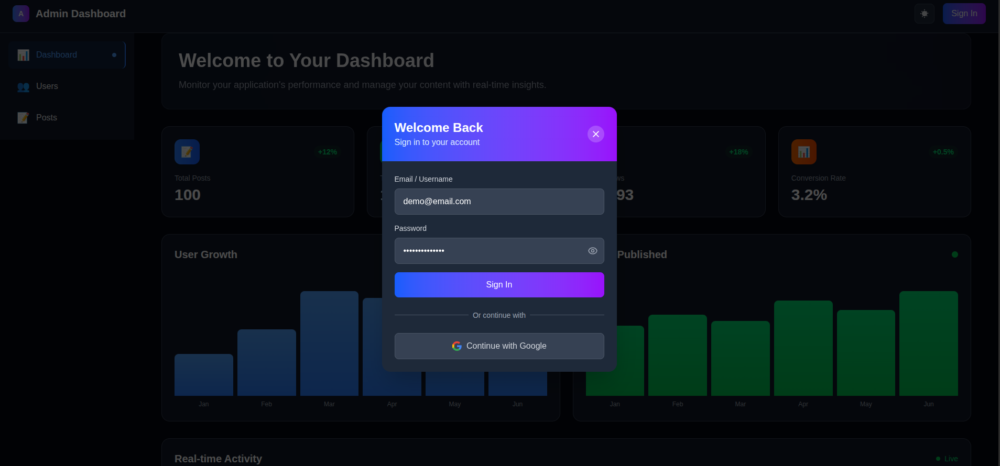
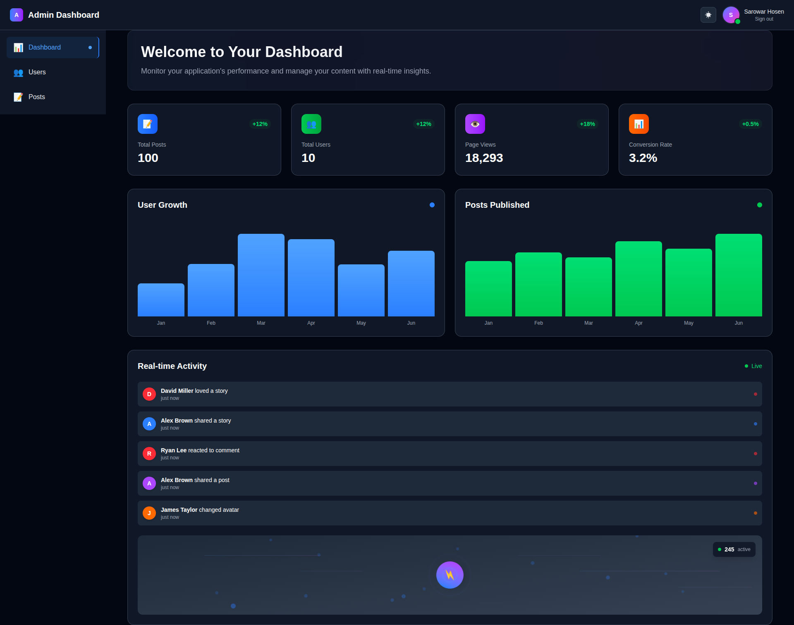
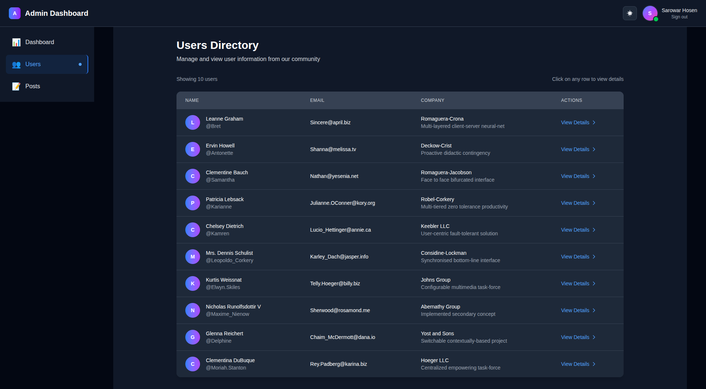
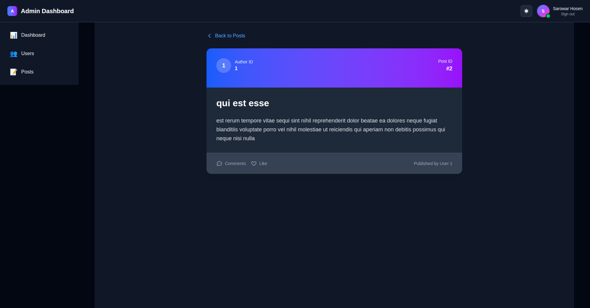
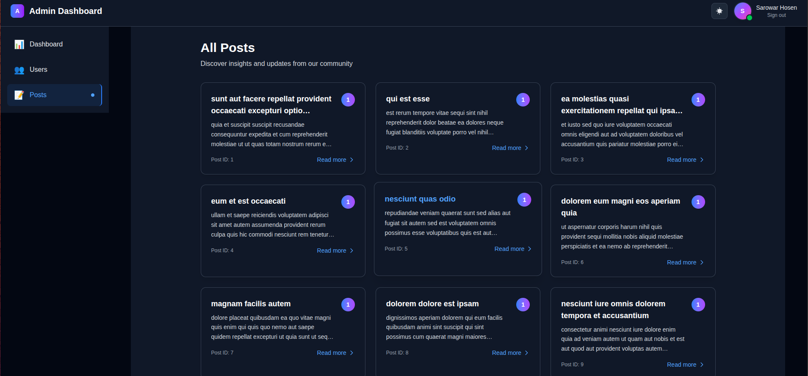

# Admin Dashboard

A modern, responsive admin dashboard built with Next.js 15, TypeScript, and Tailwind CSS. This project features a complete authentication system, real-time data visualization, and a beautiful user interface with dark mode support.

## 🔴 Live Demo

Visit the deployed app here: [admin-dashbard-mauve.vercel.app](https://admin-dashbard-mauve.vercel.app/)

## 🖼️ Screenshots

> Note: All screenshots are stored under `public/assets/`.


### Authentication



### Dashboard



### Users




### Post Details



### All Posts Overview



## 🚀 Features

### 🔐 Authentication System

- **NextAuth.js Integration**: Secure authentication with multiple providers
- **Credentials Login**: Username/password authentication with demo credentials
- **Google OAuth**: One-click Google sign-in
- **Auto-login Modal**: Automatic login prompt for unauthenticated users
- **Session Management**: Persistent user sessions with proper state handling

### 📊 Dashboard Components

- **Real-time Activity Feed**: Live user activity with animated indicators
- **Statistics Grid**: Key metrics with animated counters and trend indicators
- **Interactive Charts**: Data visualization with smooth animations
- **Welcome Section**: Personalized dashboard greeting

### 👥 User Management

- **Users Directory**: Complete user listing with responsive table
- **User Details Modal**: Detailed user information with smooth animations
- **Responsive Design**: Works perfectly on all devices

### 📝 Posts Management

- **Posts Listing**: Grid layout with beautiful post cards
- **Post Details**: Individual post pages with full content
- **Dynamic Routing**: SEO-friendly URLs for each post
- **Loading States**: Smooth loading animations and error handling

### 🎨 UI/UX Features

- **Dark Mode**: Complete dark/light theme support
- **Framer Motion**: Smooth animations throughout the app
- **Responsive Design**: Mobile-first approach
- **Modern Components**: Reusable, well-structured components
- **Accessibility**: ARIA labels and keyboard navigation

## 🛠️ Tech Stack

- **Framework**: Next.js 15 (App Router)
- **Language**: TypeScript
- **Styling**: Tailwind CSS
- **Animations**: Framer Motion
- **Authentication**: NextAuth.js
- **State Management**: React Hooks
- **API**: JSONPlaceholder (for demo data)
- **Icons**: Heroicons

## 📦 Installation

1. **Clone the repository**

   ```bash
   git clone <repository-url>
   cd admin-dashboard-test
   ```

2. **Install dependencies**

   ```bash
   npm install
   ```

3. **Set up environment variables**
   Create a `.env.local` file in the root directory:

   ```env
   AUTH_GOOGLE_ID=your_google_client_id
   AUTH_GOOGLE_SECRET=your_google_client_secret
   NEXTAUTH_URL=http://localhost:3000
   NEXTAUTH_SECRET=your_secret_key
   ```

4. **Run the development server**

   ```bash
   npm run dev
   ```

5. **Open your browser**
   Navigate to [http://localhost:3000](http://localhost:3000)

## 🔑 Demo Credentials

The application comes with pre-configured demo credentials:

- **Email/Username**: `demo@email.com`
- **Password**: `strongPassword`

These credentials are automatically filled in the login form for easy testing.

## 📱 Pages & Routes

### Main Dashboard (`/`)

- Overview of key metrics and statistics
- Real-time activity feed
- Interactive charts and visualizations

### Users (`/users`)

- Complete user directory
- Responsive table with user information
- Click any row to view detailed user information in a modal

### Posts (`/posts`)

- Grid layout of all posts
- Click any post card to view full post details
- Dynamic routing for individual posts (`/posts/[id]`)

## 🎯 Key Components

### Authentication

- `LoginModal`: Beautiful login form with show/hide password
- `Navbar`: Navigation with user profile and authentication status

### Data Display

- `UsersTable`: Responsive table for user data
- `UserModal`: Detailed user information modal
- `PostCard`: Reusable post display component
- `StatsGrid`: Animated statistics display

### UI Components

- `LoadingSpinner`: Reusable loading component
- `ErrorMessage`: Error display component
- `NotFoundMessage`: 404-style component
- `BackButton`: Animated back navigation

### Custom Hooks

- `useFetch`: Generic API data fetching hook
- `useUsers`: User data management
- `usePosts`: Post data management
- `useRealtimeActivity`: Real-time activity simulation

## 🎨 Design System

### Colors

- **Primary**: Blue gradient (`from-blue-500 to-purple-600`)
- **Success**: Green (`green-500`)
- **Error**: Red (`red-500`)
- **Warning**: Orange (`orange-500`)

### Typography

- **Headings**: Bold, clear hierarchy
- **Body**: Readable, accessible font sizes
- **Code**: Monospace for technical content

### Spacing

- Consistent spacing using Tailwind's spacing scale
- Responsive padding and margins
- Proper component spacing

## 🔧 Development

### Project Structure

```
├── app/
│   ├── components/          # Reusable UI components
│   ├── hooks/              # Custom React hooks
│   ├── posts/              # Posts pages and routing
│   ├── users/              # Users pages
│   └── layout.tsx          # Root layout
├── auth/                   # Authentication configuration
├── data/                   # Static data and configuration
└── public/                 # Static assets
```

### Code Quality

- **TypeScript**: Full type safety
- **ESLint**: Code linting and formatting
- **Component Architecture**: Modular, reusable components
- **Custom Hooks**: Logic separation and reusability

## 🚀 Deployment

### Vercel (Recommended)

1. Push your code to GitHub
2. Connect your repository to Vercel
3. Set environment variables in Vercel dashboard
4. Deploy automatically

### Other Platforms

The app can be deployed to any platform that supports Next.js:

- Netlify
- AWS Amplify
- Railway
- DigitalOcean App Platform

## 🤝 Contributing

1. Fork the repository
2. Create a feature branch (`git checkout -b feature/amazing-feature`)
3. Commit your changes (`git commit -m 'Add some amazing feature'`)
4. Push to the branch (`git push origin feature/amazing-feature`)
5. Open a Pull Request

## 📄 License

This project is licensed under the MIT License - see the [LICENSE](LICENSE) file for details.

## 🙏 Acknowledgments

- [Next.js](https://nextjs.org/) for the amazing React framework
- [Tailwind CSS](https://tailwindcss.com/) for the utility-first CSS framework
- [Framer Motion](https://www.framer.com/motion/) for smooth animations
- [NextAuth.js](https://next-auth.js.org/) for authentication
- [JSONPlaceholder](https://jsonplaceholder.typicode.com/) for demo data

## 📞 Support

If you have any questions or need help with the project, please:

- Open an issue on GitHub
- Check the documentation
- Review the code comments

---

**Built with ❤️ using Next.js, TypeScript, and Tailwind CSS**
